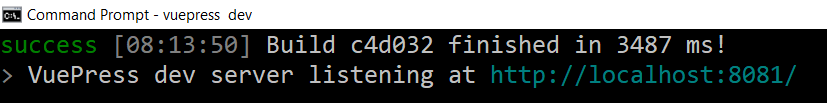
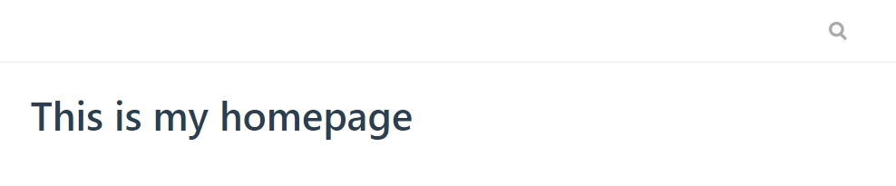
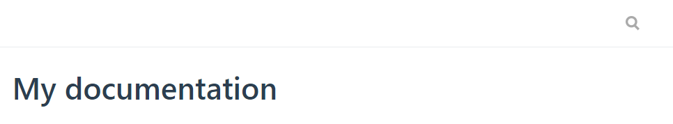

# VuePress - Learning site


Personal learning application to understand VuePress using a step by step approach.

To build the static version, just run `npm run build`.

Static files will be generated in folder `docs\.vuepress\dist.`; these files have to be copied onto the website.

## Install VuePress

If needed, install NPM by installing [Node.js](https://www.npmjs.com/get-npm) *(npm is distributed with Node.js- which means that when you download Node.js, you automatically get npm installed on your computer)*.

Then, in a DOS prompt, install VuePress. Use the `-g` option to install it globally: we'll be able to create as many site as wanted. By installing VuePress locally, you'll need to install (and update) each time a copy of VuePress.

```
npm install -g vuepress
```

That's it.

## Running VuePress (dev mode)

First create a new folder on your disk where you'll put your VuePress website. Let's say `C:\sites\vuepress`. Create that folder.

In a DOS prompt, go to that folder (f.i. `C:\sites\vuepress`) and start `vuepress dev`.

So run these two instructions:

```
cd C:\sites\vuepress
vuepress dev
```

After a few seconds, you'll get an output like this:



You can now start to develop your `C:\sites\vuepress` site by adding Markdown documents and by adjusting some settings of VuePress. Every changes will be immediately visible at `http://localhost:8081/`.

## Open your website

Just start your browser and open `http://localhost:8081/`, you'll get a stylized 404 error page: it's normal since your `C:\sites\vuepress` is still empty (remember VuePress was installed globally). 

Create a file called `readme.md` in the `C:\sites\vuepress\` folder with this content: `# This is my homepage`. Save the file and go back to `http://localhost:8081/`.

You'll get this nice page:



Go back to your DOS session and press <kbd>CTRL</kbd>+<kbd>C</kbd> to stop VuePress command. We need to make some configuration.

## Write Markdown documents (the best way)

*You can remove the `C:\sites\vuepress\readme.md`, we don't need it anymore.*

Create a `C:\sites\vuepress\docs` folder, your Markdown files will be stored them. Put there a first markdown file like, f.i. `C:\sites\vuepress\docs\readme.md` with this content: `# My documentation`.

Before visiting the `http://localhost:8081/` once more, we first need to inform VuePress that our files are under the `docs` subfolder (and no more at the root folder), this is done by adding a file called `package.json`:

1. Create the file `C:\sites\vuepress\package.json` if that file isn't yet present
2. Open the file with a text editor and put this content:

```json
{
	"scripts": {
        "dev": "node_modules/.bin/vuepress dev docs",
        "build": "node_modules/.bin/vuepress build docs"
    }
}
```

From now, to run your local site, the command will be 

```
npm run dev
```

So, run that command and when successful, open the `http://localhost:8081/` URL.



Open your `C:\sites\vuepress\readme.md` file and make changes, save them: without the need to refresh the browser, changes will be immediately visible thanks to `hot reloading` feature of NPM.

## vuepress dev or npm run dev ?

The standard `vuepress dev` command will start the VuePress server in the root folder i.e. `C:\sites\vuepress\`; that's OK but since we decided to put our files in the `docs` folder (and changed the `package.json` file in that way), since now, we'll use `npm run dev` for starting the server. `vuepress dev` won't be used anymore.*

## Add more content

We'll create three new markdown files:

* `C:\sites\vuepress\docs\chapter1.md` with this content: `# My first chapter`,
* `C:\sites\vuepress\docs\chapter2.md` with this content: `# My second chapter`,
* `C:\sites\vuepress\docs\chapter3.md` with this content: `# My third chapter`.

And we'll update `C:\sites\vuepress\docs\readme.md` with this content: 

```markdown
# My documentation

* [Chapter 1](./chapter1.html)
* [Chapter 2](./chapter2.html)
* [Chapter 3](./chapter3.html)
```

Remember the hot reload feature: switch back to your browser and display the `http://localhost:8081/` page again. You've not press <kbd>F5</kbd> and yet, you've well the updated version.

Now, you can see that your readme page has a table of content and every links are working.

## Adjust settings

See https://vuepress.vuejs.org/guide/basic-config.html#config-file

## Build a static version of the site

To build the static version, just run `npm run build` (in folder `C:\sites\vuepress`).

Static files will be generated in folder `C:\sites\vuepress\docs\.vuepress\dist.`; these files have to be copied onto the website.

### Test the static site locally

You just need to create a localhost alias like you do every time; f.i. create a new alias for Wamp:

```conf
Alias /test_vuepress "C:/temp/a/docs/.vuepress/dist"

<Directory "C:/temp/a/docs/.vuepress/dist/">
    Options Indexes FollowSymLinks
    AllowOverride all
  <IfDefine APACHE24>
    Require local
  </IfDefine>
  <IfDefine !APACHE24>
    Order Deny,Allow
	  Deny from all
	  Allow from localhost ::1 127.0.0.1
	</IfDefine>
</Directory>
```

The alias should points to the `/docs/.vuepress/dist` folder since files are there.

Because we're using an alias like `http://localhost:8080/test_vuepress`, we need to tell VuePress that our `base` folder is `test_vuepress`. This is only needed locally and this is done by creating (updating) the `/docs/.vuepress/config.js` file with this content:

```javascript
module.exports = {
  base: "/test_vuepress/"
};
```
